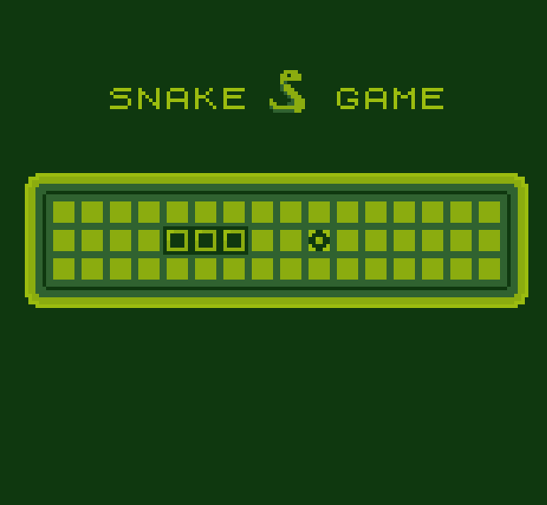

# Another-Gameboy-Emulator
A very simple Gameboy emulator for educational purposes 

Usage: Another-Gameboy-Emulator [ROM]

Continuing on learning emulator development I've developed a rudimentary script to run GB games, I split the script into 8 sections (Excluding MAIN) to ease the coding.

CARTRIDGE INFO AND ACTIONS: All metadata read from the header of the cartridge, anything related to loading ROMs, and everything about memory bank controller types and switching (currently missing MBC3 real time clock RTC)

TIMER: Placeholder as it lacks the any form of delay which is inaccurate to GB cycles

Joypad: Mapping the Gameboy joypad interrupts to the Gameboys buttons to be mapped to pygame in another section, requests an interrupt when a button is changed to pressed state.

PPU: Everything related to graphics processing, visual rendering, background, window and sprites,
plus LCD modes and STAT interrupts.

MMU: Mapping for the Gameboys 64kb address space (RAM, ROM, I/O register, VRAM), audio is stored but is never used. Placed a placeholder DMA which just copies all bytes but realistically is inaccurate to actual GB DMA and will be fixed if I come back to this script in the future, there is no audio processing unit currently

CPU and OPCODES: everything related to SM83 cpu, opcodes ,and GB assembly commands are here, implements all 245 standard opcodes and the 256 CB-prefixed ones, plus flags, interrupts and the HALT bug.

 
FRAME LOOP: Runs the cpu, timer, PPU until a frame is done

GAME SCREEN: everything pygame related and frame caps at 60 to keep the emulator stable across setups

The code is technically inaccurate to GB but passes checks so it works but not cycle accurate, includes no audio processing unit, Has no battery-backed saves, No Gameboy color support, Gameboy DMG only and no clock for MBC3 games but that can be fixed in future revisions and will add drag and drop if I come to this script in the future.

AI disclosure: The code is written by me for the most part while following tutorials and documentations as its for educational purposes but whenever I have an error I don't understand or something isn't explained well I ask AI for help fixing it or ask it to help me write a portion and explain it to me, for the most part I understand every line in this script which is the goal of this project.

references:
https://www.inspiredpython.com/course/game-boy-emulator/let-s-write-a-game-boy-emulator-in-python

https://gbdev.io/pandocs/

https://www.youtube.com/watch?v=HyzD8pNlpwI

https://rylev.github.io/DMG-01/public/book/

https://gbdev.io/gb-asm-tutorial/

https://github.com/tbsp/simple-gb-asm-examples

https://blakesmith.me/2023/05/11/learning-homebrew-game-boy-game-development-in-assembly.html

https://github.com/baekalfen/pyboy

https://github.com/tuliomoreira77/python-simple-gb-emulator

